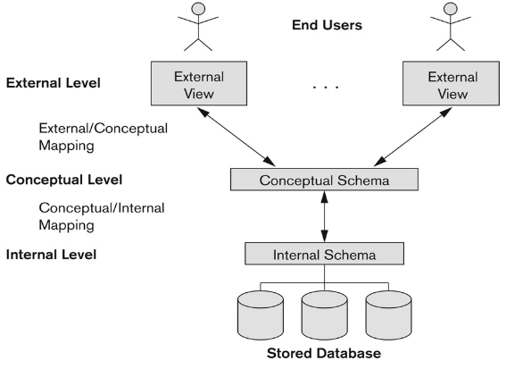

# Database System
## Database (DB)
**Non-redundant**  
**Persistent  collection  records/files**  
**Support various processingand retrieval needs**
## Database Management System (DBMS)  
**A Software programs manages interaction between end users and DB**  
**For creating, storing, updating, andaccessing the data in DB**
## Architecture
  
- Naive Users  
  **Running application programs**
- Interactive Users  
  **Using query languages**
- Application Programmers  
  **Writing embedded DML in a host language**
- Database Administrator (DBA)  
  **Schema definition**  
  **Storage structure and access method definition**  
  **Schema and physical organization modification**  
  **Granting of authorization for data access**  
  **Integrity constraint specification**
- DB Manager
  **Interface between stored data and application programs/queries**  
  **Translate conceptual level commands into physical level ones**  
  **Access control**  
  **Concurrency control**  
  **Backup & recovery**  
  **Integrity**
- File Manager  
  **Alocation of space**  
  **Operations on files**
  

# ER Diagram
