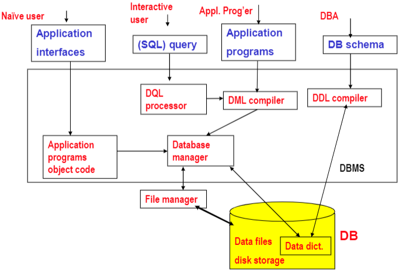
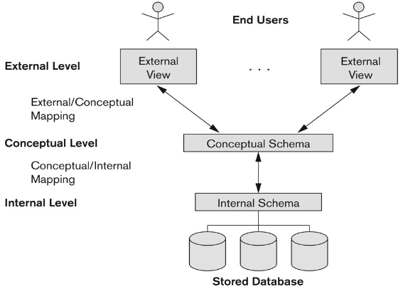
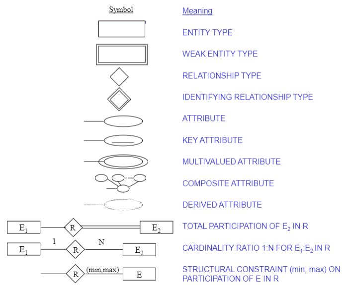

# Database System
## Terms
| Informal | Formal |
| --- | --- |
| Table | Relation |
| Column Header | Attribute |
| All possible Column Values | Domain |
| Row | Tuple |
| Table Definition | Schema of a Relation |
| Populated Table | State of the Relation |

- Super key  
**Meet uniqueness**
- Candidate key  
**Meet uniqueness and minimal**  
- Primary key  
**Most recognizable key**  
- Alternate Key  
**All candidate keys that are not selected as primary keys**
- Foreign key  
The key that refers to the primary key on other tables
## Database (DB)
**Non-redundant**  
**Persistent  collection  records/files**  
**Support various processingand retrieval needs**
## Database Management System (DBMS)  
**A Software programs manages interaction between end users and DB**  
**For creating, storing, updating, andaccessing the data in DB**
## Architecture
  
- Naive Users  
  **Running application programs**
- Interactive Users  
  **Using query languages**
- Application Programmers  
  **Writing embedded DML in a host language**
- Database Administrator (DBA)  
  **Schema definition**  
  **Storage structure and access method definition**  
  **Schema and physical organization modification**  
  **Granting of authorization for data access**  
  **Integrity constraint specification**
- DB Manager
  **Interface between stored data and application programs/queries**  
  **Translate conceptual level commands into physical level ones**  
  **Access control**  
  **Concurrency control**  
  **Backup & recovery**  
  **Integrity**
- File Manager  
  **Alocation of space**  
  **Operations on files**
  


## Relational Integrity Constraints
- Inherent/Implicit Constraints
- Schema-based/Explicit Constraints
  - Domain  
    **Composite and multi-valued attributes are not allowed**  
    **Limit the values that it can contain (data type)**
  - Key (Super key / Candidate key)
  - Entity integrity  
    **Primary key cannot null**
  - Referential integrity (Foreign key)
- Application-based/Semantic Constraints

# Inference Rules of Functional Dependency (FD)
| Rule | Case |
| --- | --- |
| Reflective | If X subset Y, then X -> Y |
| Augmentation | If X -> Y, then XZ -> YZ |
| Transitive | If X -> Y and Y -> Z, then X -> Z |
| Decomposition | If X -> YZ, then X -> Y and X -> Z |
| Union | If X -> Y and X -> Z, then X -> YZ |
| Pseudotransitive | X -> Y and WY -> Z, then WX -> Z |

# Database Design
- No repetition of data/information
- No potential inconsistency
- Ability to represent all information
- No Loss of data/information
### ER Diagram

## Normalization
**Reversible decomposition**  
**No lost information**  
**No spurious tuples**  
**Individual relation**  
**Inferred from other dependencies after decomposition**
- First Normal Form (1NF)
  **Attribute must be atomic (no composite or multivalued attributes)**  
  **Problem:**  
  **Inability to represent certain information**  
  **Deleting tuple will destroy entity information**  
  **Potential inconsistency when updating a tuple**
- Second Normal Form (2NF)
  **Single Column Primary Key**  
  **Replace the original table by two sub-tables (no partial dependency)**
- Third Normal Form (3NF)
  **Replace the SECOND table by two sub-tables (no transitive dependency)**
- Boyce-Codd Normal Form (BCNF/3.5NF)
  **Remove Dependency in 3NF**
  
# SQL
## Command
```sql
// Searching in DB
SELECT <attribute *|...,...|DISTINCT ...>
FROM <table list>
WHERE <condition>
GROUP BY <grouping attribute(s)>
HAVING <group condition>
ORDER BY <attribute list ASC|DESC>

// Create Table
CREATE TABLE <table name> (
  <column name> <type> <NOT NULL|NULL|DEFAULT value>,
  ...,
  CONSTRAINT <constraint name> PRIMARY KEY <column list>,
  CONSTRAINT <constraint name> FOREIGN KEY <column> REFERENCES <table name>(column),
  CONSTRAINT <constraint name> CHECK <condition>,
  CONSTRAINT <constraint name> UNIQUE <column list>
);

// Modify Table data
INSERT INTO <table name> (<column list>) VALUES (<value list>);
DELETE FROM <table name> WHERE <condition>
UPDATE <table name> SET <column name> = <value>, ... WHERE <condition>

// Modify table structure
DROP TABLE <table name>;
ALTER TABLE <table name> ADD <column name> <column type>;
ALTER TABLE <table name> DROP COLUMN <column name>;
ALTER TABLE <table name> MODIFY/ALTER COLUMN <column name> <column type>;

// Modify table constraint
ALTER TABLE <table name> DROP CONSTRAINT <constraint name>
ALTER TABLE <table name> ALTER COLUMN <column name> DROP DEFAULT;
ALTER TABLE <table name> ADD CONSTRAINT <constraint type> <argument>

// Create Index
CREATE [UNIQUE] INDEX <index name> ON <table name> (column list ASC|DESC);
// Drop Index
DROP INDEX <index name>;

// Create View
CREATE [OR REPLACE] VIEW <view name> AS
SELECT <column list>
FROM <table name>
WHERE <condition>

// Drop View
DROP VIEW <view name>
```
## Operator & Function
> https://www.w3schools.com/sql/sql_operators.asp  
> https://www.w3schools.com/sql/sql_ref_sqlserver.asp

### Overall
| Type | Operator | Description |
| :---: | :---: | --- |
| Arithmetic | + <br />	- <br /> * <br /> / <br /> % | Add <br /> Subtract <br /> Multiply <br /> Divide <br /> Modulo	|
| Bitwise  | & <br /> \| <br /> ^ |	Bitwise AND <br /> Bitwise OR <br /> Bitwise exclusive OR |
| Comparison | = <br /> > <br /> < <br /> >= <br /> <= <br /> <> <br /> | Equal to	<br /> Greater than <br /> Less than <br /> Greater than or equal to <br /> Less than or equal to <br /> Not equal to |
| Compound | += <br /> -= <br /> \*= <br /> /= <br /> %= <br /> &= <br /> ^-= <br /> \|\*= | Add equals <br /> Subtract equals <br /> Multiply equals <br /> Divide equals <br /> Modulo equals <br /> Bitwise AND equals <br /> Bitwise exclusive equals <br /> Bitwise OR equals |
| Logical | ALL <br /> ANY/SOME <br /> EXISTS <br /> AND <br /> OR <br /> NOT <br /> BETWEEN ... AND ... <br /> IN <br /> LIKE | TRUE if all of the subquery values meet the condition	<br /> TRUE if any of the subquery values meet the condition	<br /> TRUE if the subquery returns one or more records	<br /> TRUE if all the conditions separated by AND is TRUE	<br /> TRUE if any of the conditions separated by OR is TRUE	<br /> Displays a record if the condition(s) is NOT TRUE	<br /> TRUE if the operand is within the range of comparisons	<br /> TRUE if the operand is equal to one of a list of expressions	<br /> TRUE if the operand matches a pattern |

### Like operator
| LIKE Operator Pattern | Description |
| --- | --- |
| LIKE 'a%' | Finds any values that start with "a" |
| LIKE '%a'	| Finds any values that end with "a" |
| LIKE '%or%' | Finds any values that have "or" in any position |
| LIKE '\_r%'	| Finds any values that have "r" in the second position |
| LIKE 'a\_%'	| Finds any values that start with "a" and are at least 2 characters in length |
| LIKE 'a\_\_%'	| Finds any values that start with "a" and are at least 3 characters in length |
| LIKE 'a%o'	| Finds any values that start with "a" and ends with "o" |
