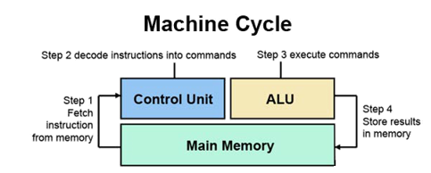

# Hardware
- Main Memory(RAM)
  - A set of locations(sequentially numbered addresses) stores data and programs
  - Volatile (lost  when computer shut down)
- I/O Modules  
  **Moves data between the computer and the external environment**
- System Bus  
  **Communication among processors, main memory, and I/O modules**
- Program Counter(PC)  
  **Holds address of the next instruction to be fetched**
- Instruction Register(IR)  
  **Store fetched instruction**
- Accumulator(AC)  
  **Store execution result temporarily**

# Processor
**Control Unit and Arithmetic & Logic Unit(ALU)**  

## Type
- Microprocessor  
  **Contains a processor on a single chip**
- Multiprocessors  
  **Contains multiple processors(cores) on a single chip**
- Graphical Processing Units(GPUs)
  - Single-Instruction Multiple Data(SIMD) techniques 
  - efficient computation on arrays of data
- Digital Signal Processors(DSPs)
  - Encoding/decoding speech and video (codecs)
  - Provide support for encryption and security
- System on a Chip (Soc)
  - handheld devices
  - CPUs, caches, DSPs, GPUs, I/O devices and main memory(same chip)

# Instruction Execution
1. Instruction fetch (IF - Fetch)  
  a. Fetch main memory address that stores in PC  
  b. Store instruction to IR  
  c. PC point to next instruction address
2. Instruction decode and register fetch (ID - Decode)  
**Interpret current instruction – opcode and operand(address)**
3. Execute (EX - Execute)  
  a. Store operand in memory address register(MAR)  
  b. Fetch data with MAR address and store in memory data register(MDR)  
  c. Simple data – Pass to AC
4. Register write back (WB - Store)

# Program Status Word(PSW)
**Contains execution status information (1 = Set, 0 = Reset)**
## Conditional Flags
- Carry(CY)
- Parity(P) - (**1 = Number of 1 is even, 0 = Number of 1 is odd**)
- Auxiliary carry(AC) - (**1 = Lower Nibble(LN) carry**)  
**Usage on Binary coded Decimal(BCD)**
  - LN > 9 then add 6 to ACC
  - LN < 9 and AC = 1 then add 6 to ACC
  - AC = 1 and LN in ACC < 9 then add 6 to LN
  - CY = 1 and Upper Nibble(UN) < 9 then add 6 to UN
- Zero(Z) - (**1 = ACC is zero**)
- Sign Flag(S) - (**Most Significant Bit(MSB)**)
- Overflow flag(OV) - (**1 = out of range**)  
`** In 2's complement [-2^(N-1), 2^(N-1) - 1]**`

  | In MSB | Out MSB | Overflow |
  | :---: | :---: | :---: |
  | 0 | 0 | 0 |
  | 0 | 1 | 1 |
  | 1 | 0 | 1 |
  | 1 | 1 | 0 |
## Control Flags
- Trap - (**1 = single-step, 0 = Normal execute**)
  - For debugging
  - break every instruction to see the variable and register
- Interrupt (**1 = enable interrupt, 0 = disable interrupt**)
- Direction (**1 = read memory from high to low, 0 = low to high**)

# Interrupt
**Typically indicate that some device or software needs service**
## Hardware Interrupt
1. Use interrupt line to signal the processor 
2. Wait processor finishing the current instruction
3. Processor send signal acknowledgement of interrupt
4. Processor push PSW and PC onto control stack
## Software Interrupt
