# Operating System

## Overview
- Controls the execution of application programs
- An Interface between applications and hardware
- Making a computer more convenient to use (Convenience)
- Allowing computer resources to be used efficiently (Efficiency)
- Permitting effective development, testing and introduction of new system functions without interfering with service (new / upgrade hardware, new services, fixes)  
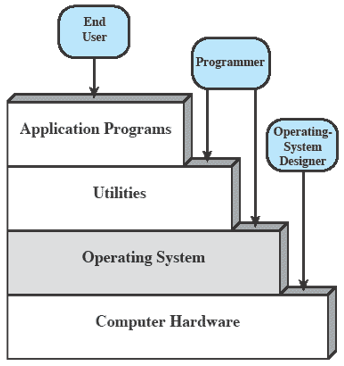

## Service
- Program development (editor and debugger)
- Program execution
- Access I/O devices (read and write)
- Controlled access to files (protection and permission)
- System access (user authorization)
- Error detection and response (deal with error)
- Accounting (collect usage statistics and monitor performance)

## Instruction Execution
1. Instruction fetch (IF - Fetch)  
  a. Fetch main memory address that stores in PC  
  b. Store instruction to IR  
  c. PC point to next instruction address
2. Instruction decode and register fetch (ID - Decode)  
  **Interpret current instruction – opcode and operand(address)**
3. Execute (EX - Execute)  
  a. Store operand in memory address register(MAR)  
  b. Fetch data with MAR address and store in memory data register(MDR)  
  c. Simple data – Pass to AC
4. Register write back (WB - Store)

## Interrupt
**Typically indicate that some device or software needs service**
### Type
- Hardware Interrupt (External)
- Internal Interrupt (Error while executing)
- Software Interrupt
### Flow
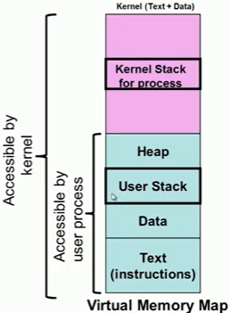  
1. Use interrupt line to signal the processor  
2. Wait processor finishing the current instruction  
  **Need to wait till completion of important jobs (atomic operation)**  
3. Processor send signal acknowledgement of interrupt  
4. Push PSW, PC and other registers(if needed) onto control stack  
5. Use interrupt ID to find the Interrupt Service Routine(ISR) address in interrupt vector  
6. Load new PC value based on interrupt  
7. Check the interrupt finish or not (if needed)  
8. Restore the all value and continue executing instruction
> https://www.geeksforgeeks.org/difference-between-hardware-interrupt-and-software-interrupt/

| Type | Hardware | Software |
| :---: | --- | --- |
| Generation | External device or hardware | Any internal system |
| PC | No increment | Increment |
| Method | invoked with external device | Invoked INT instruction |
| Priority | Lowest than software interrupts | Highest |
| Synchronous | Asynchronous | Synchronous |
| Type | Maskable Interrupt <br/> Non Maskable Interrupt | Normal Interrupts <br/> Exception |
| Example | Keystroke depressions and mouse movements | All system calls |

# Hardware
- Main Memory(RAM)  
  **A set of locations(sequentially numbered addresses) stores data and programs**  
  **Volatile (lost  when computer shut down)**
- Secondary Memory  
  **Provides large nonvolatile storage capacity**  
  **Store program and data files**
  - Magnetic disk (Surface divide into tracks, subdivide into sectors)
  - Magnetic Tape
  - Optical disk (Encodes binary data (bits) in the form of pits and lands)
  - USB flash drive
  - Mass storege device
- I/O Modules  
  **Moves data between the computer and the external environment**
- System Bus  
  **Communication among processors, main memory, and I/O modules**
- Program Counter(PC)  
  **Holds address of the next instruction to be fetched**
- Instruction Register(IR)  
  **Store fetched instruction**
- Accumulator(AC)  
  **Store execution result temporarily**
- Processor  
  **Control Unit and Arithmetic & Logic Unit(ALU)**  
  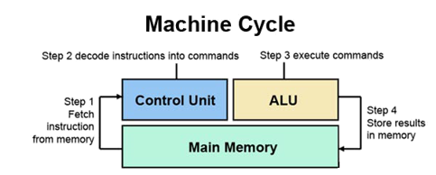
  - Microprocessor  
    **Contains a processor on a single chip**
  - Multiprocessors  
    **Contains multiple processors(cores) on a single chip**
  - Graphical Processing Units(GPUs)
    **Single-Instruction Multiple Data(SIMD) techniques**  
    **efficient computation on arrays of data**
  - Digital Signal Processors(DSPs)
    **Encoding/decoding speech and video (codecs)**  
    **Provide support for encryption and security**
  - System on a Chip (Soc)
    **handheld devices**  
    **CPUs, caches, DSPs, GPUs, I/O devices and main memory(same chip)**

# Cache Memory
> https://www.geeksforgeeks.org/cache-memory-in-computer-organization/  
> https://www.gatevidyalay.com/direct-mapping-cache-mapping/
## Overview
- Holds frequently requested data and instructions
- Reduce the average time to access data from the Main memory
- Checks for a corresponding entry in the cache first
- Allocates a new entry and copies in data from main memory for a cache miss  
  **Hit ratio = hit / (hit + miss) = no. of hits/total accesses**
- Higher cache block size, higher associativity to reduce miss rate
## Mapping
- Direct Mapping
  - Address space is split into index field(main memory) and tag field(cache)
  - Maps each block of main memory into one possible cache line  
    **Cache line number = (Main memory block number) Modulo (Number of lines in the cache)**
  - Trashed a old block if a new block needs to be loaded
  - Performance is directly proportional to the Hit ratio
  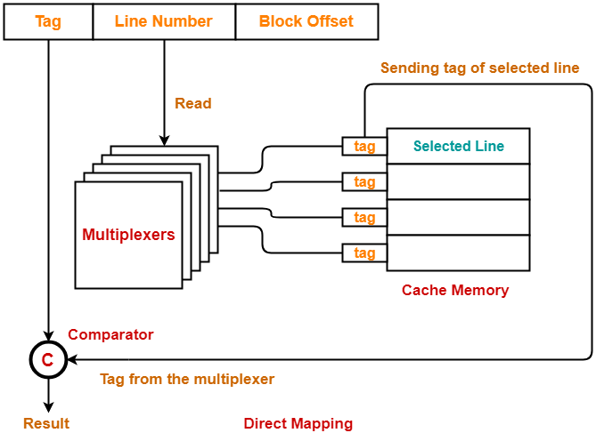
- Fully Associative Mapping
  - A block of main memory can be mapped to any freely available cache line
  - Replacement algorithm is needed if the cache is full
    - Least Recently Used (LRU) - probably the most effective  
      **Replace the cache line that has been in the cache the longest with no references to it**
    - First-in First-out (FIFO)  
      **Replace the cache line that has been in the cache the longest**
    - Least Frequently Used (LFU)  
      **Replace the cache line that has experienced the fewest references**
    - Random  
      **Pick a line at random from the candidate lines**
  - More flexible than direct mapping
- K-way Set Associative Mapping
  - Cache lines are grouped into sets, each set contains k number of lines
  - A block of main memory can map to one set of the cache
  - Memory block can map to any freely available cache line  
    **Number of line in the in the cache number of sets = (Number of sets in cache) * (Number of liness in each set)
    **Cache set number = (Main memory block number) Modulo (Number of sets in cache)**
  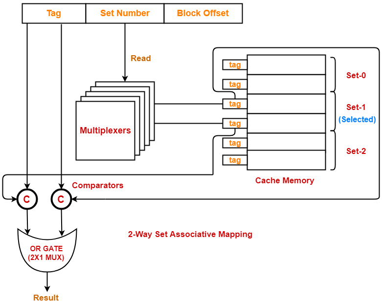

# Program Status Word(PSW)
**Contains execution status information (1 = Set, 0 = Reset)**
> https://www.youtube.com/watch?v=ZcePbkpVpTg  
> https://www.youtube.com/watch?v=doV9_m7NWWc
## Conditional Flags
- Carry(CY)
- Parity(P) - (**1 = Number of 1 is even, 0 = Number of 1 is odd**)
- Auxiliary carry(AC) - (**1 = Lower Nibble(LN) carry**)  
**Usage on Binary coded Decimal(BCD)**
  - LN > 9 then add 6 to ACC
  - LN < 9 and AC = 1 then add 6 to ACC
  - AC = 1 and LN in ACC < 9 then add 6 to LN
  - CY = 1 and Upper Nibble(UN) < 9 then add 6 to UN
- Zero(Z) - (**1 = ACC is zero**)
- Sign Flag(S) - (**Most Significant Bit(MSB)**)
- Overflow flag(OV) - (**1 = out of range**)  
  `** In 2's complement [-2^(N-1), 2^(N-1) - 1]**`

  | In MSB | Out MSB | Overflow |
  | :---: | :---: | :---: |
  | 0 | 0 | 0 |
  | 0 | 1 | 1 |
  | 1 | 0 | 1 |
  | 1 | 1 | 0 |
## Control Flags
- Trap - (**1 = single-step, 0 = Normal execute**)
  - For debugging
  - break every instruction to see the variable and register
- Interrupt (**1 = enable interrupt, 0 = disable interrupt**)
- Direction (**1 = read memory from high to low, 0 = low to high**)

# I/O Techniques
- Programmed I/O
  > http://inputoutput5822.weebly.com/programmed-io.html
  ## Overview
  **Processor execute a program to direct control**  
  **Need to wait for I/O module to respond**  
  **I/O module must interpret the address lines**  
  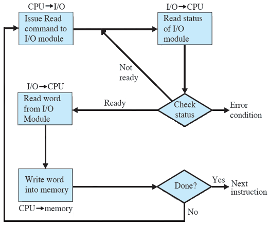
  
  | Advantage | Disadvantage |
  | --- | --- |
  | Simple to implement | Low utilization of CPU |
  ## Command
  - Control: activate a peripheral and tell it what to do
  - Test: Test status conditions (power on-off, completed and errors)
  - Read: I/O module to obtain data from the peripheral and place it in an internal buffer  
          I/O module place it on the data bus when processor request obtaining data
  - Write: I/O module takes data from the data bus and transmits it to the peripheral
  ## Instruction
  | Isolated I/O | Memory Mapped I/O |
  | --- | --- |
  | Separate memory space | Memory from the main memory |
  | Limited instructions can be used <br/> IN, OUT, INS, OUTS | Any instruction which references to memory |
- Interrupt-driven I/O
  > http://inputoutput5822.weebly.com/interrupt-driven-io.html
  ## Overview
  **Similar to programmed I/O**  
  **Can execute other program while waiting I/O module to respond**  
  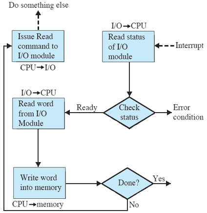
  
  | Advantage | Disadvantage |
  | --- | --- |
  | Fast than programmed I/O | Tricky to write if using a low-level language |
  | High utilization of CPU | Usually done by the hardware manufacturer |
  ## Instruction
  **To determine an interrupt signal in multiple I/O modules with the processor**  
  **To process multiple interrupts with the processor**
  
  ---
  
  ### Solving
  - Multiple Interrupt Lines (high priority)  
    **Provide multiple interrupt lines between processor and I/O modules**
    **Not practical**
  - Software Poll (ordered priority)  
    **Interrupt branches to an interrupt service routine**  
    **Every I/O module has an addressable status register and can be read by the processor to determine the interrupting module**  
    **Poll with the command line and place on the address line**
    **Time consuming**
  - Daisy Chain (Hardware Poll, Vectored, ordered priority)  
    **Processor propagate interrupt acknowledgment throughout the series of I/O modules until requesting module**  
    **Module responds by placing a word (vector - address or specific identifier) on the data lines**  
    **Processor directs the module based on vector**  
    **Removes the need for interrupt-service routine**
  - Bus Arbitration (Vectored, high priority)  
    **I/O module gaining control over the bus before requesting for the interrupt**  
    **Processor sends interrupt acknowledgment then requesting module places vector on the data lines**  
    Limited to only one module at a time
- Direct memory access (DMA)
  > http://inputoutput5822.weebly.com/direct-memory-access.html  
  > https://en.wikipedia.org/wiki/Direct_memory_access#Burst_mode
  ## Overview
  **Transfer data between main memory and external device without passing through the processor**  
  **Processor has to share system bus with DMA module**  
  **Only consume time when data transfer**  
  **More efficient when large volume of data has to be transferred**  
  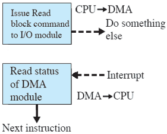
  
  | Advantage | Disadvantage |
  | --- | --- |
  | Read / write memory not through processor | Increases system cost (DMA controller) |
  | Faster processing | Need to solve cache coherence problems |
  ## Instruction
  ### Mode
  - Burst mode  
    **Transfer block of data in one contiguous sequence**  
    **Transfers all data in the data block before releasing control of system buses back to the CPU**  
    **CPU long periods of time inactive**
  - Cycle stealing mode  
    **System bus requested via BR and deasserted via BG to CPU (one byte)**  
    **Slower than burst mode**  
    **CPU idle is not longer than burst mode**  
    **Useful for monitor data in real time.**
  - Transparent mode  
    **Only transfers data when CPU does not use system buses**  
    **Needs to determine CPU is not using the system buses (complex)**  
    **CPU never stops executing its programs**  
    **DMA transfer is free in terms of time**  
    **Takes the most time to transfer a block of data**  
    **Most efficient in terms of overall system performance**
  ### Cache conherence
  - Bus snooping  
    **External writes are signaled to the cache controller**  
    **Cache invalidation for DMA writes**  
    **Cache flush for DMA reads**
  - Managed by software  
    **Flush cache line before outgoing DMA transfer**  
    **Invalidated cache line before DMA transfer access memory range (not accessed by any running threads)**  
    **Introduces some overhead to the DMA operation (loop to invalidate each cache line)**
  - Hybrids  
    **L2 cache is coherent**  
    **L1 cache (typically on-CPU) is managed by software**
  ### Configurations
  - Single-bus, detached DMA  
    **Share the same system bus**  
    **DMA module (surrogate processor) uses programmed I/O to exchange data between memory and an I/O module**  
    **Transfer a word consumes two bus cycles (inefficient)**  
    **Inexpensive**  
  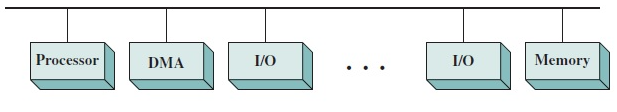
  - Single-bus, integrated DMA  
    **DMA module:**  
    **Controls multiple I/O modules (not include system bus)**  
    **Only to exchange data with memory using system bus that shares with the processor**  
    **Exchange data outside system bus with I/O modules**  
  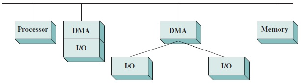
  - I/O bus  
    **I/O modules are connected to the DMA module using an I/O bus (reduce I/O interfaces)**  
    **Easily expandable configuration**  
    **Only to exchange data with memory using system bus that shares with the processor**  
    **Exchange data outside system bus with I/O modules**  
  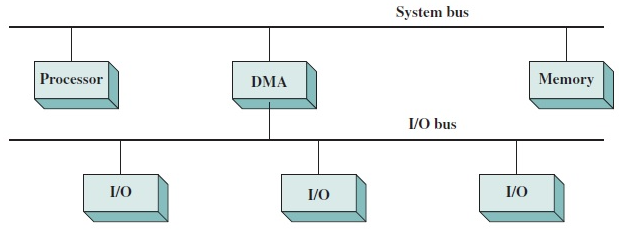

# Program
- Uniprogramming - **Only one program is running at a given time**  
  > https://er.yuvayana.org/uniprogramming-and-multiprogramming-with-their-differences/

  | Advantage | Disadvantage |
  | --- | --- |
  | Small unit memory (easy design) | Waste CPU utilization |
  | Execute with minimal overhead | Compared to fundamental memory, disk memory has long access time |
  | No intrude (100% processor’s time on application) |  |
  | Suitable for mbedded system |  |
- Multiprogramming - **More than one program to execute**

  | Advantage | Disadvantage |
  | --- | --- |
  | High CPU utilization | Require CPU scheduling |
  |  | Memory management (difficult design) |
- Parallel Programming - **Execute program same time**

# Process State
## Notes
> https://www.gatevidyalay.com/process-states-in-operating-system/  
> https://www.geeksforgeeks.org/states-of-a-process-in-operating-systems/
- Minimum states:
  - New state, ready state, run state and terminate state (4)
  - Requires the I/O operation (5)
- N processor can execute only N process at a time
- State to suspend state
  - Moving a process with lower priority from ready state to suspend ready state
  - Moving a process with lower priority from wait state to suspend wait state
## State
- New / Create  
  **A program present in secondary memory that will be picked up by OS to create and initiate the process for execution**
- Run  
  **The process is assigned to the CPU and executed by any one of the available CPU cores**
- Terminated or completed  
  **After execution is completed**  
  **The process in context (PCB) is deleted by the OS**
- Ready  
  **The process load into main memory**  
  **The process ready to run and wait to get the CPU time for its execution (queue)**
- Suspend ready  
  **A process with higher priority has to be executed but the main memory is full**  
  **Free memory by moving a lower priority process to suspend ready state**  
  **When main memory becomes available, the process is brought back to the ready state**
  **Process have problem**  
  **For debugging**  
  **A process execute periodically and suspend while waiting for the next time**  
  **Examine or modify the suspended process or coordinate the activity of various child process**
- Wait or Blocked  
  **A process requests access to I/O or needs input from the user or needs access to a critical region**  
  **The process goes to the ready state when I/O operation is completed**
- Suspend wait or Suspend blocked  
  **Similar to suspend ready but uses the process which was performing I/O operation**
  **The process goes to the suspend ready when I/O operation is completed**
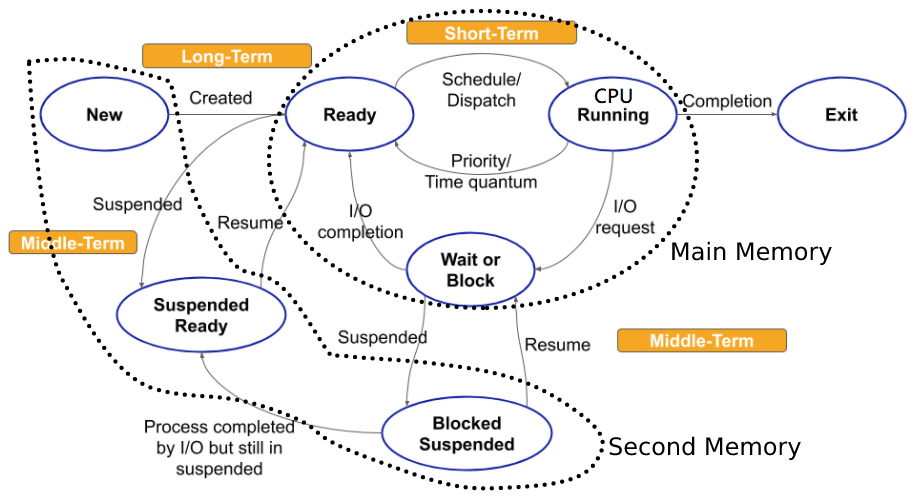  
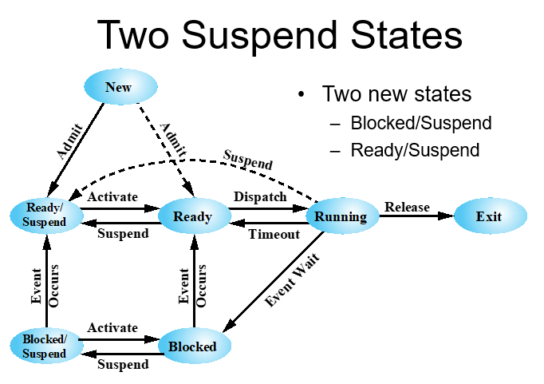

# Process
> https://afteracademy.com/blog/what-is-burst-arrival-exit-response-waiting-turnaround-time-and-throughput
### Burst time
**Execution total time by processor on the CPU**  
### Arrival time
**Process enters into the ready state and ready execution**  
### Exit time
**Process completes execution and exit the system**  
### Response time
**Process is in the ready state and gets the CPU for the first time (Burst time of all previous process - Arrival time)**  
### Turnaround time
**process come from ready state for the first time to its completion (Burst time + Waiting time or Exit time - Arrival time)**  
### Waiting time
**process in the ready state waiting for CPU(Turnaround time - Burst time)**
### CPU and IO Bound Processes
**If the process is intensive in terms of CPU operations then it is called CPU bound process. Similarly, If the process is intensive in terms of I/O operations then it is called IO bound process**
### Mode
> https://www.tutorialspoint.com/User-Mode-vs-Kernel-Mode
- User mode
  - Running user application
  - Transit to kernel mode when the application requests help of the operating system, an interrupt or a system call occurs
- Kernal mode
  - Starts in kernel mode when the system boots
  - Executes applications in user mode after the operating system is loaded
  - Some privileged instructions that can only be executed in kernel mode (interrupt instruction and input-output management etc)
  - Resides in memory (in a protected area) all the time
- Necessity
  - The operating system can be accidentally wiped out and overwritten by data in a running user program
  - Processes can write in the same system at the same time
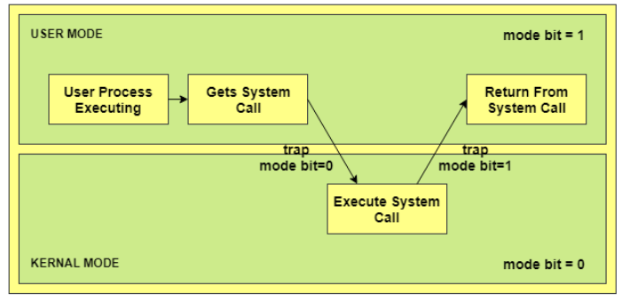
### Management
- Interleave the execution of multiple processes  
  - Starvation  
    **Lower priority process never get CPU**  
    **Increase priority of low priority processes after some fixed amount of time quantum (Aging)**  
  ---
  > https://www.geeksforgeeks.org/difference-between-dispatcher-and-scheduler/  
  > https://afteracademy.com/blog/what-is-context-switching-in-operating-system  
  - Dispatcher  
    **Small program in main memory that switches the process**  
    **Gives a process control over the CPU after it has been selected by the short-term scheduler**
    - Switching context
      - Save the current process context before putting another process in running state
      - Running process should be stopped for CPU executing higher priority process when it comes in the ready state
      - Stop the process in running state to handle the interruption when it occurs
      - Transition between user mode and kernel mode
    - Switching to user mode
    - Jumping to the proper location in the user program to restart that program
  - Scheduler 
    - Long term (job)  
      **Decides how many process store or load into main memory**  
      **The degree of multi-programming of system (How many process stay in the ready queue)**
    - Medium term  
      **Sends required I/O operation process from running queue to blocked queue**  
      **Shifted a completed I/O operation process to ready queue**
    - Short term (CPU)  
      **Select a single process in the ready queue for execution**    

| Type | Dispatcher | Scheduler |
| --- | --- | --- |
| Definition |  Just a code segment | Long-term, Short-term, Medium-term |
| Dependency | Dependent on scheduler | Works independently |
| Algorithm | / | First Come First Serve (FCFS), Shortest-Job-First (SJF), Shortest Remaining Time, <br /> Priority, Round Robin, Multilevel Queue |
| Function | Switching context, Switching to user mode, Jumping to the proper location in the user program to restart that program | Select processes |
- Allocate resources to processes
- Protect the resources of each process from other processes
- Enable processes:  
  **Share and exchange information**  
  **Synchronization among each other**
- Switch process  
  **Process switch occur any time that the operating system has gained control from the currently running process**
  #### Reason
  - Interrupt  
    **External execution of the current instruction (eg I/O interrupt, clock interrupt)**
  - Trap (illegal file access)
  - System call (os function) or supervisor call
  #### Step
  1. Save context of processor including program counter and other registers
  2. Update the PCB of current running state process
  3. Move the PCB of this process to (suspend) ready state or (suspend) block state
  4. Select another process for execution
  5. Update the PCB of the process selected
  6. Update memory management data structures
  7. Restore context of the processor to that which existed at the time the selected process was last switched out
  [Process Switching](Image/process-switching.png)
### Fork in Unix
- Allocate a slot in the process table for the new process
- Not share any memory
- Assign PID to the child process
- Make a copy of parent process image
- Assign the child process to the Ready to Run state
- Return child process PID to parent process
- Child process begins executing at the same point in the code as the parent
```cpp
pid_t pid = fork();
if (pid > 0) {} // parent
else if (pid == 0) {} // child
else {} // error in fork()
```
[Fork Transition Diagram](Image/fork-transition-diagram.png)    [Unix Process State](Image/unix-process-state.png)

# OS Control Structure
## Memory Table
**Keep track of both main (real) and secondary (virtual) memory**  
**Allocation of main memory to process**  
**Allocation of secondary memory to process**  
**Protection attributes that which process may access certain shared memory regions**  
**Manage virtual memory**
## I/O Table
**Manage the I/O devices and channels of the computer**  
**If an I/O operation is in progress, the OS needs to know:**  
  **The status of the I/O operation**  
  **The location in main memory being used as the source or destination of the I/O transfer**
## File Tables
**Existence of files**  
**Location on secondary memory**  
**Current status**  
**Other attributes**  
**May maintained by a file management system**
## Process Table
> https://www.geeksforgeeks.org/process-table-and-process-control-block-pcb/  
**One entry for each process in the process table**  
**Each entry points to a process image**
[Process Table](Image/process-table.png)
### Process Image
> https://tldp.org/LDP/LG/issue23/flower/psimage.html  
> https://www.tutorialspoint.com/inter_process_communication/inter_process_communication_process_image.htm  
**Must not modify itself at any time (readonly)**  
**Allocate a section of virtual memory for loaded program to forms useable address space**  
[Process Image](Image/process-image.png)
- Program code  
  **Dynamic paging**
  **Shared between process**
- Program data  
  **Distinguished as initialized variables and uninitialized variables including external global and static variables**
  **Data blocks are not shared between processes by default**
  **Values of variables could be changed during run time**
- Stack  
  **Each process has at least two last-in, first-out (LIFO) stacks, including a user stack for user mode and a kernel stack for kernel mode**
  **Allocate for automatic variables and function parameters**
  **Store parameters and calling addresses for procedure and system calls**
- Heap  
  **Allocate for dynamic memory storage**
- Process Control Block  
  **Data needed by the operating system to control the process**
  - Pointer  
    **Saved the current position of the process when switching one state to another state**
  - Process state  
    **Process state, priority, scheduling-related info, waiting event and data structuring**
  - Process number  
    **Stores the process identifier (PID)**
  - Program counter  
    **Next instruction address that is to be executed for the process**
  - Register  
    **CPU registers include accumulator, base registers and general purpose registers**
  - Memory limits (page table, segment tables etc)  
    **Information about memory management system used by the operating system**
  - Open files list (list of files opened for the process)  
  [Process Control Block](Image/process-control-block.png)
