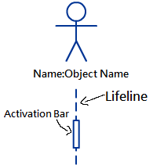
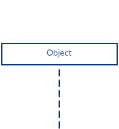
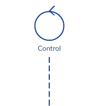
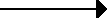
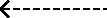
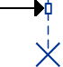
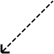
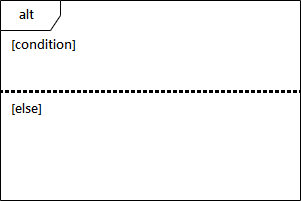

# Role of a variable
**Variable has multiple purposes (logic less obvious) => easier to introduce bugs**
- Constant/Fixed Value  
  **Initialized without any calculation**  
  **Does not change thereafter**
- Stepper  
  **Stepping through values**  
  **Can be predicted**
- Most-recent holder (hold latest value)
- Gatherer (accumulator)
- One-way flag (boolean)
- Temporary (Holding very short period)
- Organizer  
  **Rearrange element after initialization**  
  **e.g list, array**
- Transformation (Gets new value with same calculation from another variable)

# Use Case
## Diagram
**Use simple grammar**  
**Any step should lead to some progress**
- Finding actors  
  **Human/System interact with main system outside**  
  **Provide input or take output from system**
  **Role and objective**
  - Primary (interact directly with system)
  - Secondary  
    **Interact indirectly with system**  
    **Support and complete the use case with primary actor**
  - <\<include\>>  
    **Must be executed**  
    **Can extract partial function as a new use case if multiple use case needs that function**  
    **May not exist independently**  
    
  - <\<extend\>>  
    **Optional behavior with condition**  
    **Can separate independently**  
    
  - Generalization actor/use case (Inheritance)
  - Description  
    **<\<include\>> Invoke the use case XXXXX**  
    **<\<extend\>> \[Extension point: (condition), invoke XXXXX\]**

    | Field | Content |
    | --- | --- |
    | Use Case Name | Name of the use case |
    | Actor(s) | List the actors who can perform this use case |
    | Description | State clearly the purpose of the use case |
    | Reference ID | ID of use case |
    | Precondition | Describe the state of the system before the use case |
    | Postcondition | State of the system in following completion |
    | Flow of events | Interaction steps between actors and the system - actor action/system response |
    | Alternative flow of events | if any |
    | Exceptions | if any |
    | Assumptions | if any |
## Benefits
- Define the scope of the system 
- Plan the development process 
- Develop and validate the requirements 
- Form the basis for the definition of test cases 
- Structure user manuals 

# Class Diagram
> https://spicyboyd.blogspot.com/2018/07/umlclass-diagram-relationships.html  
> https://www.tutorialspoint.com/object_oriented_analysis_design/ooad_uml_basic_notation.htm
##  Relationship
| Term | Explanation | Symbol |
| --- | --- | --- |
| Dependency | A use B    |  |
| Association | A has C    |  |
| Aggregation | A owns B   Can exist independently   A needs B |  |
| Composition | B is part of A   B can exist independtly but A cannot   A must need B |  |
| Realization | interface/implements |  |
| Generalization | inheritance/extends |  |
## Class\\Object
| **Class** | **Object** |
| --- | --- |
|  |  |
### Attribute
\[\+ public\] \[\- private\] \[\# protected\]

# Sequence Diagram
> https://creately.com/blog/diagrams/sequence-diagram-tutorial/  
> https://www.visual-paradigm.com/learning/handbooks/software-design-handbook/sequence-diagram.jsp
###
**Sequence Number (1, 2, 3, 4, ... / 1.1, 1.2, 1.3, ...)**
### Object Notation
| Actor | Object | Element/Data | Interface | Controller |
| :---: | :---: | :---: | :---: | :---: |
|  |  |  |  |  |
### Message Arrow
| Synchronous | Asynchronous | Return message | Create object | Destory object | Message delay |
| :---: | :---: | :---: | :---: | :---: | :---: |
|  |  |  |  |  |  |
### Fragment
| Alternative | Optional | Loop | Parallel | Sequence diagram | Reference |
| :---: | :---: | :---: | :---: | :---: | :---: |
|  |  |  |  |  |  |
| if else | if | while/for loop | Each fragment run in parallel | Surround an entire sequence diagram | Refers to defined diagram |
